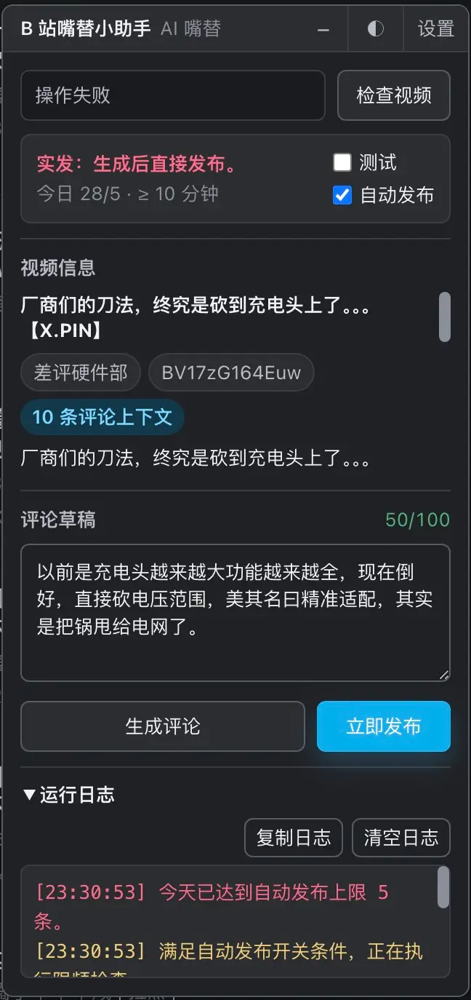

# B 站嘴替小助手

一个调用 AI 自动给 B 站视频生成一条评论内容的 Tampermonkey 脚本。它会提取当前视频标题、简介、UP 主、分区、时长、标签、CC 字幕以及页面中已加载的高赞评论与置顶评论，再通过 OpenAI-compatible Chat Completions API 生成一条可编辑的中文评论。CC 字幕作为视频实际内容的直接来源（主锚点），标签、分区和置顶/高赞评论作为辅助参考素材，共同提升生成评论与视频的相关性。无 CC 字幕时自动回退到标签+评论逻辑。

脚本的核心用途是帮你起草一条贴合视频内容的评论。打开视频页后面板会自动提取视频信息，点击"生成评论"即可起草，可选择"填入评论框"（仅填入，不发送）或"发送评论"（填入并直接发送）。

## 功能

- 自动视频识别：打开视频页后面板自动提取 BV 号、标题、简介、UP 主、分区、时长、标签、CC 字幕、URL 和最多 10 条高赞评论（按热度排序，含少量高赞二级回复）及最多 3 条置顶评论。
- AI 评论生成：调用 OpenAI-compatible `/chat/completions` 接口生成一条中文评论；CC 字幕作为视频实际内容的主锚点，标签、分区、置顶评论和高赞评论作为辅助参考素材随 prompt 一起发送。字幕经压缩处理（提取核心文本、合并断句、过滤语气词、限长 2000 字），无字幕时回退到标签+评论逻辑。
- 风格预设：内置轻松活泼、理性正式、友好鼓励、犀利观点和自定义提示词。
- 可编辑结果：生成内容会先进入面板文本框，可修改后再填入 B 站评论框。
- 分级发布操作：点击"填入评论框"仅填入文本不发送（安全预览），点击"发送评论"填入并直接发送。
- 自动发布限频：支持每日自动评论上限、10 分钟间隔、本次运行最多 1 条等保护。
- 低调浮动面板：默认以最小化形态（仅标题栏）出现在右下角，点击标题栏即可展开；可拖动改变位置；可彻底隐藏（隐藏后只能通过油猴菜单“显示浮动面板”恢复）；支持亮色/暗色手动切换。
- 亮色/暗色适配：浮动面板和设置弹窗支持手动切换主题。

## 界面预览

## 安装

1. 安装脚本管理器：[Tampermonkey](https://www.tampermonkey.net/) 或 [Violentmonkey](https://violentmonkey.github.io/)。
2. 打开 Greasy Fork 页面安装脚本：[B 站嘴替小助手](https://greasyfork.org/scripts/583255)。
3. 登录 B 站，打开形如 `https://www.bilibili.com/video/BV...` 的视频页。
4. 页面右下角应显示“B 站嘴替小助手”面板（默认最小化为标题栏，点击展开）。

脚本使用 `@connect *`，因为 OpenAI-compatible API 地址由用户配置。Tampermonkey 首次请求某个 API 域名时可能要求授权。

## 快速开始

1. 打开一个视频页，面板会以最小化形态（仅标题栏）出现在右下角，点击标题栏展开，自动提取视频信息（标题、UP 主、简介、字幕状态等）。
2. 点击标题栏右侧“设置”，填写 API 地址、模型名称、API Key 和生成偏好。
3. 点击“生成评论”，检查并编辑生成文本。
4. 点击“填入评论框”仅填入文本（不发送），或点击“发送评论”填入并直接发送。
5. 如需生成后自动发送，勾选“自动发布”（受每日上限和 10 分钟间隔限制）。
6. 想彻底隐藏面板？点击标题栏右侧的“×”按钮；恢复时通过油猴菜单的“显示浮动面板”即可。

## 配置

点击浮动面板标题栏右侧的“设置”，或从脚本管理器菜单选择“打开 B 站嘴替小助手设置”。

- API 地址：基础地址，如 `https://api.deepseek.com/v1`，也支持完整 `/chat/completions` 地址。
- 模型名称：默认 `deepseek-v4-flash`，可填写服务商实际提供的模型 ID。
- API Key：仅存入脚本管理器配置，不写入源码。
- Temperature：范围 0～2，默认 1.0。
- 评论风格预设：轻松活泼、理性正式、友好鼓励、犀利观点、自定义。
- 风格提示词：附加给系统提示词的具体要求；选择预设会自动填入，可继续编辑。
- 每日自动评论上限：自动发布每天最多发送的评论数，默认 5 条。

本项目不需要本地代理，因此没有 `.env.example`。

## 自动发布约束

自动发布只有同时满足以下条件才会执行：

- 用户主动勾选“自动发布”。
- 当前视频没有已处理记录。
- 距离上次发布至少 30 秒。
- 本次脚本运行尚未发布评论。
- 当天发布数少于设置中的“每日自动评论上限”。
- 登录状态可确认，页面没有验证码或风险提示。

自动发布在生成完成后触发。检测到“验证码”“操作频繁”“账号存在风险”等提示时会立即停止，不会尝试绕过。

## 数据与安全

- API Key 保存在脚本管理器配置中，具有被浏览器扩展、恶意脚本或本机用户读取的风险。建议使用限额、可撤销的专用 Key。
- 不要把 API Key 写入脚本源码或提交到版本控制。
- 脚本不读取、保存或记录 Cookie、CSRF Token，也不会在日志中显示完整 API Key。
- 脚本不绕过验证码、风控、登录限制或平台限制。
- “填入评论框”仅填入文本不发送，可安全预览；“发送评论”和“自动发布”会直接发送，不再二次确认。

## 已知限制

- B 站是 SPA，DOM 和 Web Components 会持续变化；页面改版可能导致选择器失效。
- 评论提取只读取当前页面已经渲染的顶层评论，不主动翻页。
- 脚本仅在视频页（`www.bilibili.com/video/*`）运行，不覆盖动态页、空间页等其他场景。
- 播放列表、番剧、稍后再看等特殊页面布局可能无法提取或发布。
- 发布成功以“点击发送后输入框清空”为页面侧证据；网络延迟、审核或页面改版可能导致结果不确定。
- LLM 输出会检查非空、AI 自述和 20～100 字长度，但内容真实性和质量仍需人工复核。

## 常见问题

<b>“填入评论框”和“发送评论”有什么区别？</b>

“填入评论框”仅将生成的评论填入 B 站评论输入框，不会点击发送按钮，适合预览和手动确认。“发送评论”会在填入后直接点击 B 站的发送按钮。评论发布是账号行为，误发、频繁发送或内容不合适都可能触发平台风控，建议先用“填入评论框”确认质量。

<b>为什么需要滚动到评论区？</b>

B 站评论区通常是懒加载的。先滚动到评论区可以让脚本获得更完整的评论上下文，也能提高找到评论编辑器的成功率。高赞评论会作为参考素材发给 AI，帮助它更准确地贴合视频实际内容，因此评论越多、越完整，生成评论的相关性通常越强。

<b>可以使用哪些模型？</b>

只要服务商兼容 OpenAI Chat Completions API，通常都可以尝试。模型名称、API 地址和 Key 需要以服务商实际文档为准。

<b>面板太碍事，能隐藏吗？隐藏后怎么恢复？</b>

可以。面板标题栏右侧有一个“×”按钮，点击即可彻底隐藏面板（连标题栏都不显示）。隐藏后只能通过油猴脚本管理器菜单中的“显示浮动面板”来恢复。如果只是想缩小占用，点击标题栏即可在“仅标题栏”和“完整面板”之间切换，无需彻底隐藏。

<b>如何重置脚本数据？</b>

在脚本管理器的脚本存储界面删除 `bllmc_config_v1`、`bllmc_processed_v1` 和 `bllmc_publish_stats_v1`。

## 更新日志

- v0.9.0 (2026-06-21)：收紧监听范围与面板交互重构。`@match` 仅保留 `www.bilibili.com/video/*`，移除动态页、空间动态页、空间视频页和列表页的匹配——评论操作只在视频页发生，脚本不再在这些页面注入任何 UI；同步移除已失效的 `Discovery` 模块、`Page.isDiscoveryPage`、`renderDiscovery`、`discoveryRoots` 选择器及 `Controller.check` 的动态页分支。面板默认以最小化形态（仅标题栏）出现，点击标题栏即可展开/收起，`collapsed` 不再持久化，每次加载都是最小化。移除 FAB 悬浮按钮及其相关代码（`buildFab`/`showFab`/`expandFromFab`/`collapseToFab`、`APP.fabId`、FAB CSS），由“最小化标题栏 + 彻底隐藏”取代。标题栏新增“×”隐藏按钮，点击后面板完全消失，只能通过油猴菜单“显示浮动面板”恢复（隐藏状态下不再做后台视频提取）。油猴菜单中语义模糊的“切换面板/FAB”替换为两个独立命令：“显示浮动面板”和“隐藏浮动面板”。
- v0.8.2 (2026-06-20)：修复验证码/风险提示误判。风控检测不再扫描整个页面文本，改为仅检查实际可见的验证码组件及弹窗/Toast，并排除脚本自身界面，避免隐藏节点、普通评论或运行日志中的关键词触发误报。
- v0.8.1 (2026-06-20)：自动发布间隔从 10 分钟降至 30 秒；修复 busy 状态下所有按钮同时显示转圈动画的问题，改为仅当前操作按钮显示转圈，其余按钮仅降低透明度。
- v0.8.0 (2026-06-20)：UI 面板重构。移除“检查视频”按钮，改为打开面板/切换视频时自动提取视频信息，视频信息区保留“↻”小图标供手动重新提取；移除“测试”复选框和动态按钮文案逻辑，改为两个显式按钮——“填入评论框”（仅填入不发送）和“发送评论”（填入并直接发送），用户按需选择，无需理解“测试模式”概念；移除视频标签 chips 展示（标签仍会抓取并发送给 AI，但 UI 不再逐个显示，改为在元信息行显示“N 标签”计数）；视频信息卡片由多行 chips 改为单行“·”分隔的紧凑元信息行；简化模式栏为“自动发布”复选框 + 今日配额；`Publisher.publish` 新增 `send` 参数替代原 `config.testMode` 判断，`Controller.publish` 默认 `send = isAutomatic`。
- v0.7.1 (2026-06-19)：UI 体验改进。视频信息卡片补全分区、时长、标签 chips 和字幕状态徽章（有字幕显示字符数，无字幕提示回退）；设置弹窗加 dirty 跟踪，有未保存改动时点遮罩/ESC/取消会二次确认，避免误关丢草稿；主操作按钮（检查/生成/发布）执行中显示“正在检查…/正在生成…/正在发布…”进行中文案，结束后恢复原文案。
- v0.7.0 (2026-06-19)：新增 CC 字幕作为视频内容主锚点。通过 `player/v2` 接口抓取 CC 字幕（优先中文简繁体），压缩处理后（提取 content、合并断句、过滤语气词、句间换行、限长 2000 字保留首尾）作为视频实际内容发给 AI，使 AI 从“靠标题+评论间接推断”升级为“直接看到视频讲了什么”，相关性显著提升。无 CC 字幕时自动回退到 v0.6.9 的标签+评论逻辑。`getAid` 升级为 `getAidAndCid` 同步取 cid，`buildUserPrompt` 优先用字幕，`SYSTEM_PROMPT` 第 3 条说明字幕为最主要依据，检查日志补充字幕字符数。
- v0.6.9 (2026-06-19)：扩充发给 AI 的相关性素材。新增抓取视频分区、时长、标签（`__INITIAL_STATE__` 优先，标签 API 兜底）；单独提取 UP 主/置顶评论并在 prompt 中标注为"理解视频主旨的重要参考"；评论 API 抓取量从 10 扩到 30 再客户端按点赞精筛，并补充少量高赞二级回复（楼中楼）；过滤"三连/前排/沙发/催更"等无内容信息量的元评论，避免稀释相关性信号。`buildUserPrompt` 拼入分区/时长/标签/置顶评论，SYSTEM_PROMPT 第 5 条同步覆盖新增参考素材范围。
- v0.6.8 (2026-06-19)：调整高赞评论在 prompt 中的定位——从“仅用于避免撞车、禁止参考”改为“可作为理解视频实际内容与观众关注点的参考素材”，允许 AI 借鉴其中的观点角度以提升相关性，但仍禁止逐字抄写、改写或拼凑其措辞，保留原创性。SYSTEM_PROMPT 第 5 条与 `buildUserPrompt` 中对高赞评论的描述同步更新。
- v0.6.7 (2026-06-18)：缩短 Header 副标题"智能生成 · 审慎发布"→"AI 嘴替"，腾出空间避免"设置"按钮文字上下换行。
- v0.6.6 (2026-06-18)：收窄面板宽度 384px→320px，主操作按钮 min-width 104px→92px，窄屏全宽断点 520px→420px，整体更紧凑。
- v0.6.5 (2026-06-18)：UI 低调化。Header 由粉蓝渐变大色块改为跟随面板背景的单色栏，标题与副标题改为同行小字，padding 收紧，按钮用 muted 色而非反白；FAB 由粉蓝渐变改为单色描边圆点，仅 hover 时轻强调；面板 body 最大高度同步调整。
- v0.6.4 (2026-06-18)：性能与健壮性增强。Shadow DOM root 缓存新增全局 MutationObserver 主动失效，深层 shadow host 变化也能被 `findAllDeep` 同步感知；`waitForCommentEntry` 从 250ms 轮询改为 MutationObserver；`findVisibleSendButton` 兜底扫描限定到评论容器范围，不再全文档扫描；`markProcessed` 仅在超 500 条时才全量排序裁剪；`hasRiskPrompt` 加 800ms 缓存并短路 selector 检测，减少发布流程中的 reflow。
- v0.6.3 (2026-06-18)：修复设置弹窗主题不跟随面板（暗色下弹窗强制亮色）；合并 FAB 重复 click 绑定；修复拖动后误触发最小化（改为一次性 `_suppressNextClick`，并加窗口失焦兜底防止拖动状态残留）；清理路由切换重复 pageType 计算、死代码 `fillOnly`、无效 `_routeTimer` 与过时 CSS 注释。
- v0.6.2 (2026-06-18)：修复从 FAB 展开面板后最小化/主题按钮失效——`expandFromFab` 重复调用 `bindPanel` 导致事件双重绑定相互抵消，现已去除冗余绑定。
- v0.6.1 (2026-06-18)：修复最小化按钮失效（拖动监听不再拦截按钮点击）；主题改为 light/dark 两档切换，首次运行按系统偏好初始化，点击即时可见效果。
- v0.6.0 (2026-06-18)：修复动态页/空间页弹窗时机——非视频页改为悬浮按钮（FAB），点击才展开完整面板；新增面板拖动与位置记忆、主题手动切换（自动/亮/暗）、字数计数器、操作失败重试按钮、设置弹窗“测试连接”；CSS 全面变量化；Shadow DOM 根扫描加缓存并改用 MutationObserver 等待元素；UI 拆分为 PanelView / SettingsView / Controller。
- v0.5.3 (2026-06-18)：调整脚本描述和 README，突出“调用 AI 为 B 站视频生成一条可编辑评论”的核心用途。
- v0.5.2 (2026-06-18)：补充 userscript `@license MIT` 元信息，满足 Greasy Fork 发布要求。
- v0.5.1 (2026-06-18)：减少发布流程中的页面滚动跳动。
- v0.5.0 (2026-06-18)：新增评论风格预设、每日自动评论上限，并重做浮动面板和设置弹窗 UI。
- v0.4.1 (2026-06-18)：增强自动发布保护、日志和设置弹窗。
- v0.1.0 (2026-06-18)：初始版本。

## 反馈

- GitHub Issues：[提交 BUG 或建议](https://github.com/codertesla/bili-comment-buddy/issues)
- 仓库地址：[codertesla/bili-comment-buddy](https://github.com/codertesla/bili-comment-buddy)

**免责声明**：本脚本仅供学习和个人使用。使用本脚本产生的任何后果由用户自行承担。

## 许可证

MIT
